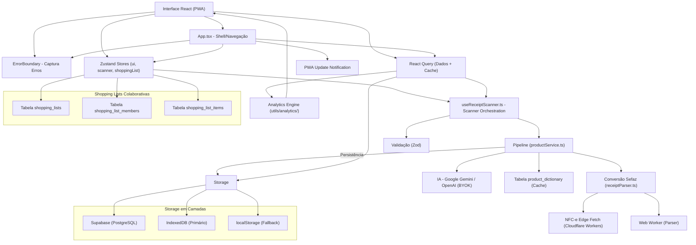

# My Mercado - Arquitetura

**Data da última atualização:** 24 de maio de 2026
**Status da arquitetura:** ✅ Conforme (React Query = Dados, Zustand = UI, Hooks = Orquestração)
**Status da refatoração:** ✅ Serviços modularizados + Componentes reestruturados + Stores fatoradas
**Status da qualidade:** ✅ 0 erros TypeScript | ✅ 0 erros ESLint | ✅ Build OK | ✅ 90+ testes
**Produtos canônicos:** ❌ Removido (migration 002_remove_canonical_products.sql + código eliminado)

**My Mercado** é um PWA para gerenciamento de compras de supermercado.
O usuário escaneia QR Code de NFC-e, consulta histórico e compara preços ao longo do tempo.
Persistência principal: Supabase (PostgreSQL + Auth + RLS), com **fallback local em camadas (IndexedDB → localStorage)**.

---

## Índice

### Parte I - Visão Geral
1. [Diagrama de Camadas](#diagrama-de-camadas)
2. [Tecnologias Utilizadas](#tecnologias-utilizadas)
3. [Lista de Dependências](#lista-de-dependências)
4. [Modelo Mental](#modelo-mental)

### Parte II - Estrutura
5. [Treeview](#treeview)
6. [Mapa de Dependências](#mapa-de-dependências)
7. [Estrutura de Dados Principal](#estrutura-de-dados-principal)
8. [Matriz de Tarefas](#matriz-de-tarefas)

### Parte III - Arquitetura
9. [Fluxo de Dados](#fluxo-de-dados)
10. [Regras de Arquitetura](#regras-de-arquitetura)
11. [Separação de Responsabilidades](#separação-de-responsabilidades-zustand-vs-react-query)

### Parte IV - Módulos Principais
12. [Módulo de Storage Unificado](#módulo-de-storage-unificado)
13. [Módulo de Validação (Zod)](#módulo-de-validação-zod)
14. [Módulo de IA](#módulo-de-ia)
15. [Módulo de Scanner](#módulo-de-scanner)
16. [Serviços Modularizados](#serviços-modularizados)
17. [Módulo de Listas de Compras Colaborativas](#módulo-de-listas-de-compras-colaborativas)
18. [Módulo de NFC-e Edge Fetch](#módulo-de-nfc-e-edge-fetch)
19. [Sistema de Error Handling Unificado](#sistema-de-error-handling-unificado)

### Parte V - Componentes Reestruturados
20. [ScannerTab](#scannertab)
21. [HistoryTab](#historytab)
22. [ShoppingListTab](#shoppinglisttab)
23. [SearchTab](#searchtab)
24. [DictionaryTab](#dictionarytab)
25. [Componentes Reutilizáveis](#componentes-reutilizáveis)

### Parte VI - Gestão de Estado
26. [Stores Fatoradas (Zustand)](#stores-fatoradas-zustand)
27. [Queries e Mutations (React Query)](#queries-e-mutations-react-query)

### Parte VII - Qualidade
28. [Error Handling](#error-handling)
29. [Testes](#testes)
30. [Acessibilidade](#acessibilidade)

### Parte VIII - Performance
31. [Otimizações de Performance](#otimizações-de-performance)
32. [PWA e Service Worker](#pwa-e-service-worker)
33. [Testes de Performance](#testes-de-performance)

### Parte IX - Deploy
34. [Build e Deploy](#build-e-deploy)
35. [Monitoramento](#monitoramento)

### Parte X - Estado Atual
36. [Evolução Recente e Estado Atual](#evolução-recente-e-estado-atual)

---

## Diagrama de Camadas



**Regra principal de dependência:**
> **Interface -> Error Boundary -> Stores (UI) + React Query (Dados) + Shopping List Store -> Validação -> Pipeline/Serviços -> Storage em Camadas**

---

## Tecnologias Utilizadas

### Frontend
- **React 18** - Framework UI
- **TypeScript 5.9** - Tipagem estática
- **Vite 6** - Build tool e dev server
- **vite-plugin-pwa** - PWA e Service Worker
- **Zustand 5** - Estado global (apenas UI)
- **Recharts** - Gráficos e visualização
- **Lucide React** - Ícones
- **React Hot Toast** - Notificações
- **React Query (TanStack Query)** - Cache e sincronização de dados
- **react-window** - Virtualização de listas
- **TailwindCSS 3** - Framework CSS utilitário

### Persistência / Backend
- **Supabase JS** - Auth + PostgreSQL + RLS + Edge Functions
- **IndexedDB** - Storage local primário (grandes volumes)
- **localStorage** - Fallback para IndexedDB

### Scanner e Parsing
- **html5-qrcode** - Leitura de QR Code (~100KB)
- **BarcodeDetector** - API nativa (quando disponível)
- **DOMParser** - Parsing HTML da Sefaz
- **Web Worker** - Processamento em thread separada
- **Cloudflare Workers** - Proxy CORS para NFC-e (via Supabase Edge Functions)

### Validação
- **Zod** - Validação type-safe de formulários

### IA (BYOK - Bring Your Own Key)
- **`@bosguega/ai-core`** (workspace) — Client de IA com suporte a Gemini e OpenAI
- Retry automático via wrapper dedicado

### Utilitários
- **currency.js** - Formatação monetária
- **date-fns** - Manipulação de datas

### Testes
- **Vitest** - Framework de testes
- **jsdom** - Ambiente de teste
- **@testing-library/react** - Testes de componentes
- **@testing-library/jest-dom** - Matchers DOM

---

## Lista de Dependências

### Produção

| Biblioteca | Versão | Uso | Tamanho Aprox. |
|---|---|---|---|
| `@supabase/supabase-js` | `2.99.3` | Backend e autenticação | ~176KB |
| `@tanstack/react-query` | `5.95.2` | Cache e sincronização | ~83KB |
| `@bosguega/ai-core` | workspace | Client de IA (Gemini + OpenAI) | Incluído |
| `@bosguega/supabase` | workspace | Shared Supabase helpers (invoke) | Incluído |
| `currency.js` | `2.0.4` | Formatação monetária | Incluído |
| `date-fns` | `4.1.0` | Manipulação de datas | Incluído |
| `html5-qrcode` | `2.3.8` | Leitura de QR Code | ~100KB |
| `lucide-react` | `0.577.0` | Ícones | ~27KB |
| `react` | `18.3.1` | Framework | ~225KB |
| `react-dom` | `18.3.1` | DOM | ~225KB |
| `react-hot-toast` | `2.6.0` | Notificações toast | Incluído |
| `react-window` | `2.2.7` | Virtualização | Incluído |
| `recharts` | `3.8.0` | Gráficos | ~349KB |
| `zustand` | `5.0.12` | Estado global | Incluído |
| `zod` | `4.3.6` | Validação | Incluído |

**Bundle Total:** ~1.04MB (gzip: ~250KB)

### Desenvolvimento

| Biblioteca | Versão | Uso |
|---|---|---|
| `@eslint/js` | `9.13.0` | Linter |
| `@types/react` | `18.3.12` | Tipos React |
| `@types/react-dom` | `18.3.1` | Tipos ReactDOM |
| `@types/react-window` | ~1.8.8 | Tipos react-window |
| `@vitejs/plugin-basic-ssl` | `1.2.0` | HTTPS em dev |
| `@vitejs/plugin-react` | `4.3.0` | Plugin React |
| `@vitest/ui` | `3.2.4` | UI de testes |
| `autoprefixer` | `10.4.20` | Prefixos CSS |
| `eslint` | `9.13.0` | Linter |
| `eslint-plugin-react` | `7.37.2` | Regras React |
| `eslint-plugin-react-hooks` | `5.0.0` | Regras Hooks |
| `jsdom` | `29.0.1` | Ambiente de teste |
| `postcss` | `8.4.47` | Processador CSS |
| `tailwindcss` | `3.4.13` | Framework CSS |
| `typescript` | `5.9.3` | Typecheck |
| `typescript-eslint` | `8.57.2` | Linter TS |
| `vite` | `6.0.0` | Build tool |
| `vite-plugin-pwa` | `0.21.0` | PWA |
| `vitest` | `3.2.4` | Testes |

---

## Modelo Mental

### Arquitetura em Camadas

```
┌─────────────────────────────────────────────────────────┐
│                    APRESENTAÇÃO                         │
│  App.tsx + Componentes + Error Boundary + A11y          │
│  PeriodSelector | PriceChart | InputDialog | etc.       │
├─────────────────────────────────────────────────────────┤
│                      ESTADO                             │
│  Zustand (UI + ShoppingList) + React Query (Dados)      │
│  + Validação (Zod)                                      │
├─────────────────────────────────────────────────────────┤
│                   LÓGICA DE DOMÍNIO                     │
│  Services + Pipeline + Analytics + IA + Utils           │
│  Collaborative Lists + Edge Fetch + Error Handling      │
├─────────────────────────────────────────────────────────┤
│                    PERSISTÊNCIA                         │
│  Supabase → IndexedDB → localStorage (Fallback)         │
│  Shopping Lists Colaborativas (Supabase Relations)      │
└─────────────────────────────────────────────────────────┘
```

### 1. Notas Fiscais (Receipts)

**Estado e operações centralizados em:**
- `src/hooks/queries/useReceiptsQuery.ts` (React Query)
- `src/services/receiptService.ts` (CRUD)
- `src/services/storageFallbackService.ts` (Fallback)

**Hooks do React Query:**
- `useAllReceiptsQuery()` - Todas as notas (para analytics/backup)
- `useReceiptsQuery()` - Paginação simples com filtros
- `useInfiniteReceiptsQuery()` - Paginação infinita
- `useSaveReceiptMutation()` - Salvar com detecção de duplicatas
- `useDeleteReceiptMutation()` - Remover com optimistic update
- `useRestoreReceipts()` - Restaurar backup

**Fallback Automático:**
```typescript
// storageFallbackService.ts
export async function getAllReceiptsFromDBWithFallback(): Promise<Receipt[]> {
  try {
    return await getAllReceiptsFromDB(); // Supabase
  } catch (error) {
    const receiptsStorage = createReceiptsStorage();
    return await receiptsStorage.getAll<Receipt>(); // IndexedDB/localStorage
  }
}
```

### 2. Scanner

**Orquestração:**
- `src/hooks/useReceiptScanner.ts`

**Estado:**
- `src/stores/useScannerStore.ts`

**Funcionalidades:**
- Câmera com html5-qrcode
- Upload de imagem
- Leitura por URL
- Modo manual
- Zoom e torch (lanterna) - limitado
- **Validação com Zod**
- Edge Fetch para proxy CORS de NFC-e

### 3. UI Global

**Estado da interface:**
- `src/stores/useUiStore.ts` - Abas, filtros, ordenação, busca
- `src/stores/useReceiptsSessionStore.ts` - Session user ID e erro de sessão
- `src/stores/useScannerStore.ts` - Estado visual do scanner

**Contém:**
- Aba ativa (`tab`)
- Filtros de histórico
- Ordenação
- Busca
- Expanded receipts

### 4. Validação

**Schema-based validation com Zod:**
- `src/utils/validation.ts`

**Schemas:**
- `receiptItemSchema` - Validação de itens
- `receiptSchema` - Receita completa
- `manualReceiptFormSchema` - Formulário manual
- `nfcUrlSchema` - URL de NFC-e
- `apiKeySchema` - API Key

### 5. Storage Unificado

**Camadas de persistência:**
- `src/utils/storage.ts`

**Hierarquia:**
1. **IndexedDB** - Primário (suporta grandes volumes)
2. **localStorage** - Fallback (~5MB limite)

**API:**
```typescript
const storage = createReceiptsStorage();
await storage.set("receipt-1", receiptData);
const receipt = await storage.get("receipt-1");
await storage.delete("receipt-1");
const all = await storage.getAll<Receipt>();
```

### 6. Domínio e Processamento

- **Parse da nota:** `src/services/receiptParser.ts`
- **Pipeline de normalização:** `src/services/productService.ts`
- **Persistência relacional:** `src/services/receiptService.ts`
- **Edge Fetch NFC-e:** `src/services/nfceEdgeFetch.ts` (Cloudflare Workers)
- **Analytics:** `src/utils/analytics/`
- **IA:** `src/utils/aiClient.ts` + `@bosguega/ai-core` (com retry automático)

### 7. Cache e Performance

- **React Query:** `src/providers/QueryProvider.tsx`
- **Hooks de query:** `src/hooks/queries/` (16 arquivos)
- **Web Worker:** `src/workers/receiptParser.worker.ts`
- **PWA Update:** `src/hooks/usePWAUpdate.ts`

### 8. Sistema de Error Handling Unificado

- **Error codes:** `src/utils/errorCodes.ts` (enum `ErrorCode`)
- **Error messages:** `src/utils/errorMessages.ts` (mapping code → mensagem pt-BR)
- **Error handler:** `src/utils/supabaseError.ts` (parse de erros Supabase)
- **Hook:** `src/hooks/useErrorHandler.ts` (notificação + log)

---

## Treeview

```text
my_mercado/
|
|-- src/
|   |-- components/
|   |   |-- ApiKeyModal.tsx
|   |   |-- ConfirmDialog.tsx
|   |   |-- DictionaryRow.tsx
|   |   |-- DictionaryTab.tsx
|   |   |-- ErrorBoundary.tsx
|   |   |-- HistoryTab/
|   |   |   ├── index.tsx
|   |   |   ├── HistoryTab.types.ts
|   |   |   ├── HeaderSection.tsx
|   |   |   ├── SummaryCard.tsx
|   |   |   ├── EmptyState.tsx
|   |   |   └── ReceiptList.tsx
|   |   |-- InputDialog.tsx
|   |   |-- InputDialog.test.tsx
|   |   |-- Login.tsx
|   |   |-- PerformancePanel.tsx
|   |   |-- PeriodSelector.tsx
|   |   |-- PriceChart.tsx
|   |   |-- PWAUpdateNotification.tsx
|   |   |-- ReceiptCard.tsx
|   |   |-- ScannerTab/
|   |   |   ├── index.tsx
|   |   |   ├── ScannerTab.types.ts
|   |   |   ├── ScannerTab.hooks.ts
|   |   |   ├── screens/
|   |   |   │   ├── IdleScreen.tsx
|   |   |   │   ├── ScanningScreen.tsx
|   |   |   │   ├── LoadingScreen.tsx
|   |   |   │   └── ResultScreen.tsx
|   |   |   ├── forms/
|   |   |   │   └── ManualReceiptForm.tsx
|   |   |   ├── views/
|   |   |   │   └── ScannerView.tsx
|   |   |   └── modals/
|   |   |       └── DuplicateModal.tsx
|   |   |-- SearchItemRow.tsx
|   |   |-- SearchItemSkeleton.tsx
|   |   |-- SearchTab.tsx
|   |   |-- SettingsTab.tsx
|   |   |-- SharedListTab/
|   |   |   └── ShareListModal.tsx
|   |   |-- ShoppingListItem.tsx
|   |   |-- ShoppingListTab.tsx
|   |   |-- ShoppingListTab/
|   |   |   ├── index.tsx
|   |   |   ├── ShoppingListTab.types.ts
|   |   |   └── ...
|   |   |-- Skeleton.tsx
|   |   |-- UniversalSearchBar.tsx
|   |   |-- UniversalSearchBar.test.tsx
|   |   |-- ui/
|   |   |   ├── Button.tsx
|   |   |   ├── Card.tsx
|   |   |   ├── EmptyState.tsx
|   |   |   └── Modal.tsx
|   |   |
|   |   |-- hooks/
|   |   |   |-- shoppingList/
|   |   |   |   ├── useLocalShoppingListActions.ts
|   |   |   |   ├── usePurchaseHistory.ts
|   |   |   |   └── useSortedShoppingItems.ts
|   |   |   |-- queries/
|   |   |   |   ├── index.ts
|   |   |   |   ├── useAllReceiptsQuery.ts
|   |   |   |   ├── useCollaborativeShoppingListsQuery.ts
|   |   |   |   ├── useDeleteReceiptMutation.ts
|   |   |   |   ├── useDictionaryQuery.ts
|   |   |   |   ├── useFilteredSearchItems.ts
|   |   |   |   ├── useFilteredSearchItems.test.tsx
|   |   |   |   ├── useHistoryReceipts.ts
|   |   |   |   ├── usePurchaseHistoryQuery.ts
|   |   |   |   ├── usePurchaseHistory.test.tsx
|   |   |   |   ├── useReceiptsQuery.ts
|   |   |   |   ├── useReceiptsSearchQuery.ts
|   |   |   |   ├── useRestoreReceiptsMutation.ts
|   |   |   |   ├── useSaveReceiptMutation.ts
|   |   |   |   ├── useSearchChartData.ts
|   |   |   |   ├── useSearchItems.ts
|   |   |   |   └── useSortedShoppingItems.test.tsx
|   |   |   |-- useApiKey.ts
|   |   |   |-- useApiKey.test.ts
|   |   |   |-- useCameraScanner.ts
|   |   |   |-- useConfirmDialog.ts
|   |   |   |-- useErrorHandler.ts
|   |   |   |-- useImageQrScanner.ts
|   |   |   |-- useManualReceipt.ts
|   |   |   |-- useNativeBarcodeScanner.ts
|   |   |   |-- usePerformanceMonitor.ts
|   |   |   |-- usePWAUpdate.ts
|   |   |   |-- useQRCodeProcessor.ts
|   |   |   |-- useReceiptScanner.ts
|   |   |   |-- useSupabaseSession.ts
|   |   |
|   |   |-- stores/
|   |   |   |-- shoppingListStore/
|   |   |   |   ├── types.ts
|   |   |   |   ├── core.ts
|   |   |   |   ├── mutations.ts
|   |   |   |   ├── selectors.ts
|   |   |   |   ├── store.ts
|   |   |   |   └── index.ts
|   |   |   |-- useReceiptsSessionStore.ts
|   |   |   |-- useScannerStore.ts
|   |   |   |-- useShoppingListStore.test.ts
|   |   |   |-- useShoppingListStore.ts
|   |   |   |-- useUiStore.ts
|   |   |
|   |   |-- services/
|   |   |   |-- authService.ts
|   |   |   |-- collaborativeShoppingListService.ts
|   |   |   |-- dictionaryService.ts
|   |   |   |-- index.ts
|   |   |   |-- nfceEdgeFetch.test.ts
|   |   |   |-- nfceEdgeFetch.ts
|   |   |   |-- productService.ts
|   |   |   |-- receiptParser.ts
|   |   |   |-- receiptService.ts
|   |   |   |-- sharedListService.ts
|   |   |   |-- shoppingListCloudSyncService.ts
|   |   |   |-- shoppingListCloudSyncService.test.ts
|   |   |   |-- storageFallbackService.ts
|   |   |   |-- supabaseClient.ts
|   |   |   |-- syncService.ts
|   |   |
|   |   |-- utils/
|   |   |   |-- ai/
|   |   |   |   ├── aiConfig.ts
|   |   |   |   ├── index.ts
|   |   |   |   ├── promptBuilder.ts
|   |   |   |   └── promptBuilder.test.ts
|   |   |   |-- analytics/
|   |   |   |   ├── aggregate.ts
|   |   |   |   ├── filters.ts
|   |   |   |   ├── groupBy.ts
|   |   |   |   ├── index.ts
|   |   |   |   └── timeSeries.ts
|   |   |   |-- validation/
|   |   |   |   └── backupSchema.ts
|   |   |   |-- aiClient.ts
|   |   |   |-- backupRegistry.ts
|   |   |   |-- currency.ts
|   |   |   |-- currency.test.ts
|   |   |   |-- date.ts
|   |   |   |-- dbDebug.ts
|   |   |   |-- errorCodes.ts
|   |   |   |-- errorMessages.ts
|   |   |   |-- filters.test.ts
|   |   |   |-- filters.ts
|   |   |   |-- idGenerator.ts
|   |   |   |-- idGenerator.test.ts
|   |   |   |-- logger.ts
|   |   |   |-- logger.test.ts
|   |   |   |-- normalize.ts
|   |   |   |-- normalize.test.ts
|   |   |   |-- notifications.ts
|   |   |   |-- pwaDebug.ts
|   |   |   |-- receiptId.ts
|   |   |   |-- search.ts
|   |   |   |-- search.test.ts
|   |   |   |-- shoppingHistoryMatch.ts
|   |   |   |-- shoppingHistoryMatch.test.ts
|   |   |   |-- shoppingList.ts
|   |   |   |-- shoppingListCloudMerge.ts
|   |   |   |-- shoppingListCloudMerge.test.ts
|   |   |   |-- shoppingListCloudSync.ts
|   |   |   |-- storage.ts
|   |   |   |-- stringUtils.ts
|   |   |   |-- supabaseError.test.ts
|   |   |   |-- supabaseError.ts
|   |   |   |-- supabaseTest.ts
|   |   |   |-- validation.ts
|   |   |
|   |   |-- providers/
|   |   |   |-- QueryProvider.tsx
|   |   |
|   |   |-- workers/
|   |   |   |-- receiptParser.worker.ts
|   |   |
|   |   |-- types/
|   |   |   |-- ai.ts
|   |   |   |-- domain.ts
|   |   |   |-- history.ts
|   |   |   |-- scanner.ts
|   |   |   |-- ui.ts
|   |   |
|   |   |-- constants/
|   |   |   |-- domain.ts
|   |   |
|   |   |-- tests/
|   |   |   |-- setup.ts
|   |   |
|   |   |-- App.tsx
|   |   |-- config.ts
|   |   |-- index.css
|   |   |-- main.tsx
|   |   |-- vite-env.d.ts
|   |
|   |-- scripts/
|   |   |-- dev.mjs
|   |   |-- testPerformance.js
|   |
|   |-- supabase/
|   |   |-- supabase_schema.sql
|   |
|   |-- .env.example
|   |-- .gitignore
|   |-- eslint.config.js
|   |-- index.html
|   |-- package.json
|   |-- tailwind.config.js
|   |-- postcss.config.js
|   |-- tsconfig.json
|   |-- vite.config.js
|   |-- vitest.config.ts
|   |
|   |-- ARCHITECTURE.md
|   |-- README.md
|   |-- LICENSE
```

---

## Mapa de Dependências

```mermaid
graph TD
    main["main.tsx"] --> ErrorBoundary["ErrorBoundary"]
    ErrorBoundary --> QueryProvider["QueryProvider"]
    QueryProvider --> App["App.tsx"]

    App --> uiStore["stores/useUiStore.ts"]
    App --> receiptsSessionStore["stores/useReceiptsSessionStore.ts"]
    App --> receiptsQuery["hooks/queries/useReceiptsQuery.ts"]
    App --> shoppingListStore["stores/shoppingListStore"]
    App --> pwaUpdate["components/PWAUpdateNotification.tsx"]

    ScannerTab --> scannerHook["hooks/useReceiptScanner.ts"]
    scannerHook --> scannerStore["stores/useScannerStore.ts"]
    scannerHook --> validation["utils/validation.ts"]
    scannerHook --> receiptsQuery
    scannerHook --> worker["workers/receiptParser.worker.ts"]
    scannerHook --> nfceFetch["services/nfceEdgeFetch.ts"]

    HistoryTab --> receiptsQuery
    HistoryTab --> ReceiptCard["components/ReceiptCard.tsx"]
    HistoryTab --> filters["utils/filters.ts"]

    SearchTab --> receiptsQuery
    SearchTab --> analytics["utils/analytics/"]
    SearchTab --> searchUtils["utils/search.ts"]
    SearchTab --> PriceChart["components/PriceChart.tsx"]

    DictionaryTab --> dictionaryQuery["hooks/queries/useDictionaryQuery.ts"]

    ShoppingListTab --> shoppingListStore
    ShoppingListTab --> purchaseHistory["hooks/shoppingList/usePurchaseHistory.ts"]
    ShoppingListTab --> collabLists["hooks/queries/useCollaborativeShoppingListsQuery.ts"]
    ShoppingListTab --> collabService["services/collaborativeShoppingListService.ts"]
    ShoppingListTab --> cloudSync["services/shoppingListCloudSyncService.ts"]

    receiptsQuery --> receiptService["services/receiptService.ts"]
    receiptService --> storage["utils/storage.ts"]
    receiptService --> supabase["services/supabaseClient.ts"]
    receiptService --> errorHandler["utils/supabaseError.ts"]

    receiptsQuery --> productService["services/productService.ts"]
    productService --> ai["utils/aiClient.ts"]
    productService --> dictionary["dictionaryService"]
    productService --> stringUtils["utils/stringUtils.ts"]

    QueryProvider --> receiptsQuery
    QueryProvider --> dictionaryQuery
    QueryProvider --> collabLists

    storage --> indexedDB["IndexedDB"]
    storage --> localStorage["localStorage"]
```



---

## Estrutura de Dados Principal

### Tabelas Principais

```sql
-- Notas fiscais
create table public.receipts (
  id text primary key,
  establishment text,
  date timestamp,
  user_id uuid references auth.users(id) default auth.uid() not null,
  created_at timestamp with time zone default now() not null
);

-- Itens das notas
create table public.items (
  id uuid primary key default gen_random_uuid(),
  receipt_id text references receipts(id) on delete cascade,
  name text,
  normalized_key text,
  normalized_name text,
  category text,
  quantity numeric,
  unit text,
  price numeric
);

-- Dicionário de produtos
create table public.product_dictionary (
  key text primary key,
  normalized_name text,
  category text,
  user_id uuid references auth.users(id) default auth.uid() not null,
  created_at timestamp with time zone default now() not null
);

-- Listas de compras colaborativas
create table public.shopping_lists (
  id uuid primary key default gen_random_uuid(),
  name text not null,
  owner_id uuid references auth.users(id) not null,
  created_at timestamp with time zone default now()
);

-- Membros de listas colaborativas
create table public.shopping_list_members (
  id uuid primary key default gen_random_uuid(),
  list_id uuid references shopping_lists(id) on delete cascade,
  user_id uuid references auth.users(id) not null,
  role text check (role in ('owner', 'editor', 'viewer')) not null default 'editor',
  joined_at timestamp with time zone default now()
);

-- Itens de listas colaborativas
create table public.shopping_list_items (
  id uuid primary key default gen_random_uuid(),
  list_id uuid references shopping_lists(id) on delete cascade,
  name text not null,
  checked boolean default false,
  checked_by_user_id uuid references auth.users(id),
  created_at timestamp with time zone default now()
);
```

---

## Matriz de Tarefas

| Quero alterar | Arquivo principal | Arquivo de apoio |
|---|---|---|
| Escaneamento (câmera/upload/link/manual) | `src/hooks/useReceiptScanner.ts` | `src/stores/useScannerStore.ts`, `src/utils/validation.ts` |
| CRUD de notas e sincronização | `src/hooks/queries/useReceiptsQuery.ts` | `src/services/receiptService.ts`, `src/services/storageFallbackService.ts` |
| Estado de abas/filtros | `src/stores/useUiStore.ts` | `src/components/*Tab.tsx` |
| Estado de sessão (user ID) | `src/stores/useReceiptsSessionStore.ts` | `src/App.tsx`, `src/components/*Tab.tsx` |
| Dicionário manual | `src/components/DictionaryTab.tsx` | `src/services/dictionaryService.ts`, `src/utils/validation.ts` |
| Tendência de preços | `src/components/SearchTab.tsx` | `src/utils/analytics/`, `src/utils/search.ts`, `src/components/PriceChart.tsx` |
| Parse da NFC-e | `src/services/receiptParser.ts` | `src/workers/receiptParser.worker.ts`, `src/services/nfceEdgeFetch.ts` |
| Proxy CORS NFC-e | `src/services/nfceEdgeFetch.ts` | Cloudflare Workers (Supabase Edge Functions) |
| Pipeline de normalização/IA | `src/services/productService.ts` | `src/utils/normalize.ts`, `src/utils/aiClient.ts`, `src/utils/stringUtils.ts` |
| Cache de queries | `src/providers/QueryProvider.tsx` | `src/hooks/queries/` (16 hooks) |
| Paginação infinita | `src/hooks/queries/useReceiptsQuery.ts` | `src/services/receiptService.ts` |
| Validação de formulários | `src/utils/validation.ts` | Zod schemas |
| Storage local | `src/utils/storage.ts` | IndexedDB API |
| Filtros e ordenação | `src/utils/filters.ts` | `src/components/HistoryTab/index.tsx` |
| Busca textual | `src/utils/search.ts` | `src/components/SearchTab.tsx` |
| Geração de IDs | `src/utils/idGenerator.ts` | IDs únicos para itens |
| Autenticação | `src/services/authService.ts` | `src/services/supabaseClient.ts` |
| Sincronização offline | `src/services/syncService.ts` | `src/services/storageFallbackService.ts` |
| Error handling | `src/components/ErrorBoundary.tsx`, `src/utils/errorCodes.ts`, `src/utils/errorMessages.ts`, `src/utils/supabaseError.ts` | React Error Boundaries |
| Error handler hook | `src/hooks/useErrorHandler.ts` | Toast + log unificado |
| PWA Update | `src/hooks/usePWAUpdate.ts` | Service Worker API |
| Formatação monetária | `src/utils/currency.ts` | Componentes de histórico, busca e lista |
| Teste de conexão | `src/utils/supabaseTest.ts` | SettingsTab |
| Manipulação de strings | `src/utils/stringUtils.ts` | `src/services/productService.ts` |
| Utilitários de data | `src/utils/date.ts` | hooks de histórico, busca e lista |
| Lista de compras local | `src/stores/shoppingListStore/` | `src/components/ShoppingListTab.tsx` |
| Lista de compras colaborativa | `src/services/collaborativeShoppingListService.ts` | `src/hooks/queries/useCollaborativeShoppingListsQuery.ts` |
| Sincronização de lista na nuvem | `src/services/shoppingListCloudSyncService.ts` | `src/utils/shoppingListCloudMerge.ts` |
| Match de histórico de compras | `src/utils/shoppingHistoryMatch.ts` | Sugestões para lista de compras |
| UI de período | `src/components/PeriodSelector.tsx` | `SearchTab`, `HistoryTab` |
| UI de busca global | `src/components/UniversalSearchBar.tsx` | SearchTab |
| Input dialog reutilizável | `src/components/InputDialog.tsx` | Diálogos de texto |
| Configuração da IA | `src/utils/ai/aiConfig.ts`, `src/utils/ai/promptBuilder.ts` | `src/utils/aiClient.ts` |

---

## Fluxo de Dados

### Fluxo Principal

```text
┌──────────────────────────────────────────────────────────────────┐
│ 1. CAPTURA                                                       │
│ Camera/Upload/Link -> useReceiptScanner -> Validação (Zod)      │
│   - NFC-e via Edge Fetch (proxy CORS)                            │
└──────────────────────────────────────────────────────────────────┘
                              ↓
┌──────────────────────────────────────────────────────────────────┐
│ 2. PROCESSAMENTO                                                 │
│ receiptParser (proxies CORS) -> productService (Pipeline)       │
│   - Normalização com IA (retry automático)                      │
│   - Categorização                                                │
│   - Match com dicionário                                         │
│   - Strip variable info (stringUtils)                           │
└──────────────────────────────────────────────────────────────────┘
                              ↓
┌──────────────────────────────────────────────────────────────────┐
│ 3. PERSISTÊNCIA                                                  │
│ useSaveReceiptMutation (React Query) -> receiptService          │
│   - Supabase (primário)                                          │
│   - IndexedDB (fallback)                                         │
│   - localStorage (último recurso)                               │
└──────────────────────────────────────────────────────────────────┘
                              ↓
┌──────────────────────────────────────────────────────────────────┐
│ 4. CACHE & RENDER                                                │
│ React Query invalidates -> Componentes leem                     │
│   - useAllReceiptsQuery / useReceiptsQuery                       │
│   - analytics utils (filtro/ordenação/agregação)                │
│   - filters.ts (filtros centralizados)                          │
│   - search.ts (busca textual)                                   │
│   - UI atualizada                                                │
└──────────────────────────────────────────────────────────────────┘
```

### Fluxo de Fallback

```text
Supabase indisponível
        ↓
┌───────────────────┐
│ Captura erro      │ ← supabaseError.ts parse
└───────────────────┘
        ↓
┌───────────────────┐
│ Tenta IndexedDB   │ ← Dados salvos localmente
└───────────────────┘
        ↓
┌───────────────────┐
│ Notifica usuário  │ ← useErrorHandler + toast
└───────────────────┘
        ↓
┌───────────────────┐
│ Sincroniza depois │ ← syncLocalStorageWithSupabase()
└───────────────────┘
```

### Fluxo de Error Handling

```text
Erro ocorre (API, Supabase, IA)
        ↓
┌───────────────────────┐
│ supabaseError.ts      │ → parseErrorCode(error): ErrorCode
│ errorCodes.ts         │ → enum ErrorCode
│ errorMessages.ts      │ → getErrorMessage(code): string pt-BR
└───────────────────────┘
        ↓
┌───────────────────────┐
│ useErrorHandler()     │ → handleError(error, context?)
└───────────────────────┘
        ↓
┌───────────────────────┐
│ Toast notification    │ → toast.error(message)
│ Logger (dev only)     │ → logger.error(code, context, error)
└───────────────────────┘
```

### Estado de UI (Zustand)

```text
useUiStore (abas, filtros, busca, expandedReceipts)
  - historyFilters: HistoryFilters (período, sortBy, sortOrder, startDate, endDate)
  - searchFilters: SearchFilters (período, startDate, endDate)
  - historyFilter: string (busca por mercado)
  - searchQuery: string (busca por produto)
  - tab: AppTab
  - expandedReceipts: string[]

useScannerStore (estado do scanner, zoom, torch, manualData)
useReceiptsSessionStore (sessionUserId, error)
useShoppingListStore (fatorada em stores/shoppingListStore/)
  - dataByUser[ownerKey]: { lists, activeListId, itemsByList, updatedAt }
```

---

## Regras de Arquitetura

### Princípios Fundamentais

1. **Frontend-First:** Sem backend Node local; app é PWA
2. **Single Source of Truth:** React Query para dados remotos
3. **Zustand para UI:** Apenas estado de interface (exceto shoppingList que é local-first)
4. **Fallback em Camadas:** Supabase → IndexedDB → localStorage
5. **Type-Safe:** TypeScript strict em todo o código
6. **Validação:** Zod schemas para todos os formulários
7. **Error Handling:** Error Boundary global + error codes + error messages
8. **Performance:** Web Workers para processamento pesado
9. **Acessibilidade:** ARIA labels, navegação por teclado
10. **Mobile-First:** UX otimizada para celular
11. **Utils Centralizados:** Funções puras em arquivos dedicados
12. **Logs apenas em DEV:** `import.meta.env.DEV`
13. **Stores Fatoradas:** Lógica pura em arquivos separados (core.ts, mutations.ts, selectors.ts)
14. **Sync Opcional:** Listas de compras com sincronização manual/automática com nuvem

### Separação de Responsabilidades

| Camada | Responsabilidade | Tecnologias |
|--------|------------------|-------------|
| **Apresentação** | UI, componentes, A11y | React, TailwindCSS, Lucide, Recharts |
| **Estado** | Gerenciamento de estado | Zustand (UI + shoppingList), React Query (dados) |
| **Validação** | Validação de entrada | Zod |
| **Domínio** | Regras de negócio | Services, Pipeline, Utils |
| **Persistência** | Armazenamento | Supabase, IndexedDB, localStorage |
| **Infra** | Build, PWA, Workers | Vite, vite-plugin-pwa, Cloudflare Workers |

### Padrões de Código

1. **Componentes pequenos:** Máximo ~200 linhas
2. **Hooks customizados:** Lógica reutilizável
3. **Comentários mínimos:** Código autoexplicativo
4. **Logs apenas em dev:** `import.meta.env.DEV`
5. **Error boundaries:** Sempre em componentes críticos
6. **Utils com funções puras:** Sem efeitos colaterais
7. **Stores fatoradas:** Lógica de mutations e selectors em arquivos separados
8. **TailwindCSS:** Classes utilitárias no JSX (com tokens CSS para temas)

---

## Separação de Responsabilidades: Zustand vs React Query

**✅ Arquitetura Consolidada:** React Query é a fonte única da verdade para dados remotos. Zustand é usado para estado de UI e estado local-first (lista de compras).

| Responsabilidade | Zustand Store | React Query |
|------------------|---------------|-------------|
| **Dados de receipts** | ❌ | ✅ `useAllReceiptsQuery`, `useReceiptsQuery`, `useInfiniteReceiptsQuery` |
| **Operações de escrita** | ❌ | ✅ `useSaveReceiptMutation`, `useDeleteReceiptMutation`, `useRestoreReceiptsMutation` |
| **Cache de leitura** | ❌ | ✅ Cache automático com staleTime e invalidação |
| **Fallback local** | ❌ | ✅ localStorage/IndexedDB integrados |
| **Sincronização** | ❌ | ✅ Auto via `invalidateQueries` e `refetch` |
| **Estado de UI** | ✅ `sessionUserId`, `error` | ❌ |
| **Filtros HistoryTab** | ✅ `historyFilters` (período, sortBy, sortOrder) | ❌ |
| **Filtros SearchTab** | ✅ `searchFilters` (período) | ❌ |
| **Scanner** | ✅ `useScannerStore` | ❌ |
| **Lista de compras (local)** | ✅ `useShoppingListStore` (local-first, fatorado) | ❌ |
| **Dicionário** | ❌ | ✅ `useDictionaryQuery` + mutations |
| **Listas colaborativas** | ❌ | ✅ `useCollaborativeShoppingListsQuery` |

**Regras de uso:**
1. **React Query:** Fonte única para todos os dados de receipts (leitura e escrita)
2. **Zustand:** Para estado de UI que não vem do servidor + lista de compras local-first
3. **Cache Inteligente:** React Query gerencia stale time, refetch on focus, invalidação automática
4. **Offline Support:** Fallback IndexedDB/localStorage integrado

---

## Módulo de Storage Unificado

**Arquivo:** `src/utils/storage.ts`

### Arquitetura em Camadas

```
┌─────────────────────────────────────┐
│     Aplicação (receiptService.ts)   │
├─────────────────────────────────────┤
│   UnifiedStorage (API unificada)    │
├──────────────┬──────────────────────┤
│  IndexedDB   │   localStorage       │
│  (Primário)  │   (Fallback)         │
└──────────────┴──────────────────────┘
```

### Classes e Funções

```typescript
// Wrapper IndexedDB
indexedDBSet(store, key, value)
indexedDBGet(store, key)
indexedDBDelete(store, key)
indexedDBGetAll(store)

// Wrapper localStorage
localStorageSet(key, value)
localStorageGet(key)
localStorageDelete(key)

// API Unificada
class UnifiedStorage {
  set(key, value)    // Retorna "indexeddb" ou "localStorage"
  get(key)
  delete(key)
  clear()
  getAll()
}

// Factories
createReceiptsStorage()
createDictionaryStorage()
createSettingsStorage()

// Utils
migrateLocalStorageToIndexedDB()
getStorageStatus()
isIndexedDBAvailable()
```

---

## Módulo de Validação (Zod)

### Schemas Principais

**Arquivo:** `src/utils/validation.ts`

```typescript
// Item de receita
receiptItemSchema = z.object({
  name: z.string().min(1),
  qty: z.string().optional().default("1"),
  unitPrice: z.string().min(1),
  unit: z.string().optional().default("UN"),
});

// Receita completa
receiptSchema = z.object({
  establishment: z.string().min(1),
  date: z.string().regex(/^\d{2}\/\d{2}\/\d{4}$/),
  items: z.array(receiptItemSchema).min(1),
});

// Formulário manual
manualReceiptFormSchema = z.object({
  establishment: z.string().min(1),
  date: z.string().regex(/^\d{2}\/\d{2}\/\d{4}$/),
  items: z.array(manualItemSchema).min(1),
});

// URL de NFC-e
nfcUrlSchema = z.string().url();

// API Key
apiKeySchema = z.string().refine((key) => 
  key.startsWith("AIza") || key.startsWith("sk-")
);
```

### Funções de Validação

```typescript
validateReceiptItem(data)        // Valida item
validateManualReceiptForm(data)  // Valida formulário manual
validateNfcUrl(url)              // Valida URL NFC-e
validateApiKey(key)              // Valida API Key
getValidationErrors(error)       // Extrai erros formatados
safeParse(schema, data, fallback) // Parse com fallback
```

---

## Módulo de IA

### Arquitetura Atual

O módulo de IA foi reestruturado para usar o workspace `@bosguega/ai-core` como client principal, com funções auxiliares em `src/utils/ai/`.

```
src/utils/
├── aiClient.ts                  # Client principal (retry, fallback)
├── aiConfig.ts                  # Configuração (modelos, prompts)
└── ai/
    ├── aiConfig.ts              # Configuração refinada de IA
    ├── index.ts                 # Barrel exports
    ├── promptBuilder.ts         # Construção de prompts para IA
    └── promptBuilder.test.ts   # Testes do prompt builder
```

### Providers Suportados

| Provider | Prefixo da Key | Modelo |
|----------|----------------|--------|
| **Google AI Studio (Gemini)** | `AIza...` | `gemini-1.5-flash` |
| **OpenAI** | `sk-...` | `gpt-4o-mini` |

### Funções

```typescript
// aiClient.ts
callAI(items)                    // Normaliza produtos (retry automático)
testAiConnection(apiKey, model)  // Testa conexão
detectProvider(apiKey)           // Detecta provider pelo prefixo

// ai/promptBuilder.ts
buildNormalizationPrompt(items)   // Constrói prompt para normalização
buildCategorizationPrompt(items) // Constrói prompt para categorização

// ai/aiConfig.ts
getDefaultModel(provider)        // Modelo padrão por provider
getMaxRetries()                  // Número máximo de retentativas
```

### Retry Automático

```typescript
const MAX_RETRIES = 2;
const RETRY_DELAY = 1000; // 1 second

// Exponential backoff
for (let attempt = 0; attempt <= MAX_RETRIES; attempt++) {
  try {
    if (attempt > 0) {
      await delay(RETRY_DELAY * attempt);
    }
    return await callGemini(items, apiKey, model);
  } catch (err) {
    lastError = err;
  }
}

// Fallback se todas as tentativas falharem
return items.map((item) => ({
  key: item.key,
  normalized_name: item.raw,
  category: "Outros",
}));
```

---

## Módulo de Scanner

**Arquivo:** `src/hooks/useReceiptScanner.ts`

### Funcionalidades

- ✅ Câmera com html5-qrcode (~100KB)
- ✅ Upload de imagem
- ✅ Leitura por URL
- ✅ Modo manual
- ✅ Zoom e torch (lanterna) - limitado
- ✅ Validação com Zod
- ✅ Detecção de duplicatas
- ✅ Edge Fetch para NFC-e (proxy CORS via Cloudflare)

### Estados da Tela

```typescript
type ScannerScreen = "idle" | "scanning" | "loading" | "result" | "manual";
```

### Estrutura de Componentes

```
ScannerTab/
├── index.tsx                  # Orquestração
├── ScannerTab.types.ts        # Tipos
├── ScannerTab.hooks.ts        # Hooks (useScannerState)
├── screens/
│   ├── IdleScreen.tsx         # Tela inicial
│   ├── ScanningScreen.tsx     # Câmera
│   ├── LoadingScreen.tsx      # Loading
│   └── ResultScreen.tsx       # Resultado (formato do histórico)
├── forms/
│   └── ManualReceiptForm.tsx  # Formulário manual
├── views/
│   └── ScannerView.tsx        # View da câmera (div para html5-qrcode)
└── modals/
    └── DuplicateModal.tsx     # Modal de duplicata
```

---

## Serviços Modularizados

### Estrutura

```
src/services/
├── index.ts                           # Export unificado
├── authService.ts                     # Autenticação e usuário
├── receiptService.ts                  # CRUD de recibos e itens
├── dictionaryService.ts               # CRUD de dicionário de produtos
├── storageFallbackService.ts          # Fallback local (IndexedDB/LocalStorage)
├── syncService.ts                     # Sincronização e status
├── productService.ts                  # Pipeline de normalização
├── receiptParser.ts                   # Parse de NFC-e (proxies CORS)
├── nfceEdgeFetch.ts                   # Edge Fetch para NFC-e
├── nfceEdgeFetch.test.ts              # Testes do Edge Fetch
├── collaborativeShoppingListService.ts # Listas colaborativas
├── sharedListService.ts               # Listas compartilhadas (legado)
├── shoppingListCloudSyncService.ts    # Sync de lista na nuvem
├── shoppingListCloudSyncService.test.ts
├── auth.ts                            # Auth helper (legado)
└── supabaseClient.ts                  # Cliente Supabase
```

### Serviços

#### `nfceEdgeFetch.ts`
**Responsabilidade:** Proxy CORS para NFC-e via Cloudflare Workers

**Funções:**
- `fetchNfceViaEdge(url)` - Busca NFC-e via Edge Function
- Utiliza `@bosguega/supabase` para `invoke` da função
- Retorna HTML parseado da Sefaz

#### `collaborativeShoppingListService.ts`
**Responsabilidade:** CRUD de listas colaborativas com membros e permissões

**Funções:**
- `joinShoppingListByCode(code)` - Entrar em lista por código
- `getShoppingListsWithMembers()` - Listar listas com membros
- `transferShoppingListOwnership()` - Transferir ownership
- `leaveShoppingList()` - Sair da lista
- RLS policies: owner, editor (CRUD items), viewer (read-only)

#### `shoppingListCloudSyncService.ts`
**Responsabilidade:** Sincronização de listas de compras locais com nuvem

**Funções:**
- `getCloudSnapshot(userId)` - Snapshot da nuvem
- `applyCloudSnapshot(data)` - Aplicar snapshot local
- Sincronização manual, no login e autosync com debounce

---

## Módulo de Listas de Compras Colaborativas

### Visão Geral

O módulo de listas colaborativas permite que múltiplos usuários compartilhem e editem listas de compras em tempo real via Supabase.

### Estrutura de Dados (Supabase)

```sql
-- Listas
create table shopping_lists (
  id uuid primary key,
  name text not null,
  owner_id uuid references auth.users(id) not null,
  created_at timestamp with time zone default now()
);

-- Membros
create table shopping_list_members (
  id uuid primary key,
  list_id uuid references shopping_lists(id) on delete cascade,
  user_id uuid references auth.users(id) not null,
  role text check (role in ('owner', 'editor', 'viewer')) not null default 'editor',
  joined_at timestamp with time zone default now()
);

-- Itens
create table shopping_list_items (
  id uuid primary key,
  list_id uuid references shopping_lists(id) on delete cascade,
  name text not null,
  checked boolean default false,
  checked_by_user_id uuid references auth.users(id),
  created_at timestamp with time zone default now()
);
```

### Serviço

**Arquivo:** `src/services/collaborativeShoppingListService.ts`

**Fluxo de Entrada:**
1. Owner cria lista com código de acesso
2. Outros usuários entram via `join_shopping_list_by_code`
3. Permissões: owner (full), editor (CRUD items), viewer (read-only)
4. Owner pode transferir ownership via `transferShoppingListOwnership`
5. Membros podem sair voluntariamente (não-owners)

### Hooks React Query

**Arquivo:** `src/hooks/queries/useCollaborativeShoppingListsQuery.ts`
- `useCollaborativeShoppingListsQuery()` - Listar listas do usuário
- `useCollaborativeShoppingListItemsQuery(listId)` - Itens de uma lista

### Sincronização Local-Nuvem

**Arquivo:** `src/services/shoppingListCloudSyncService.ts`

**Fluxo:**
1. Lista local (Zustand) é fonte primária
2. Sync opcional: manual, no login, autosync com debounce
3. Merge estrutural por lista entre local e nuvem
4. Proteção contra concorrência (updatedAt)

**Arquivo:** `src/utils/shoppingListCloudMerge.ts`
- `mergeShoppingListSnapshots(local, cloud)` - Merge estrutural

---

## Módulo de NFC-e Edge Fetch

### Visão Geral

Devido a restrições de CORS em PWAs, o app não pode fazer fetch direto das URLs de NFC-e da Sefaz. A solução é usar um proxy via Cloudflare Workers (Supabase Edge Functions).

### Arquitetura

```text
PWA (navegador)
    ↓
nfceEdgeFetch.ts
    ↓ (call Supabase Edge Function via @bosguega/supabase invoke)
Cloudflare Worker (Supabase Edge Function)
    ↓
Sefaz (NFC-e URL original)
    ↓
HTML da nota ← retorna para o PWA
```

### Serviço

**Arquivo:** `src/services/nfceEdgeFetch.ts`

**Funções:**
- `fetchNfceViaEdge(url)` - Busca NFC-e via Edge Function
- Utiliza client Supabase para chamar a Edge Function

### Testes

**Arquivo:** `src/services/nfceEdgeFetch.test.ts`
- Testes de integração com Edge Function

---

## Sistema de Error Handling Unificado

### Visão Geral

Sistema centralizado de tratamento de erros com códigos, mensagens em português e parsing de erros do Supabase.

### Estrutura

```
utils/
├── errorCodes.ts             # Enum ErrorCode com códigos
├── errorMessages.ts          # Mapping ErrorCode → string pt-BR
├── supabaseError.ts          # Parse de erros do Supabase
├── supabaseError.test.ts     # Testes
├── logger.ts                 # Log estruturado (dev only)
└── logger.test.ts            # Testes do logger
```

### errorCodes.ts

```typescript
export const enum ErrorCode {
  UNKNOWN = "UNKNOWN",
  NETWORK = "NETWORK",
  AUTH = "AUTH",
  VALIDATION = "VALIDATION",
  NOT_FOUND = "NOT_FOUND",
  DUPLICATE = "DUPLICATE",
  CORS = "CORS",
  STORAGE_FULL = "STORAGE_FULL",
  AI_FAILED = "AI_FAILED",
  NFC_E_PARSE = "NFC_E_PARSE",
  COLLAB_LIST_JOIN = "COLLAB_LIST_JOIN",
}
```

### errorMessages.ts

```typescript
export const errorMessages: Record<ErrorCode, string> = {
  [ErrorCode.UNKNOWN]: "Ops! Algo deu errado. Tente recarregar a página.",
  [ErrorCode.NETWORK]: "Erro de conexão. Verifique sua internet.",
  [ErrorCode.AUTH]: "Erro de autenticação. Faça login novamente.",
  [ErrorCode.CORS]: "Erro de CORS ao buscar NFC-e. Use entrada manual.",
  // ... mais mensagens em pt-BR
};
```

### supabaseError.ts

```typescript
export function parseErrorCode(error: unknown): ErrorCode {
  if (error instanceof AuthError) return ErrorCode.AUTH;
  if (error instanceof PostgrestError) {
    if (error.code === "23505") return ErrorCode.DUPLICATE;
    if (error.code === "42P01") return ErrorCode.NOT_FOUND;
  }
  return ErrorCode.UNKNOWN;
}
```

### useErrorHandler.ts

```typescript
export function useErrorHandler() {
  const handleError = (error: unknown, context?: string) => {
    const code = parseErrorCode(error);
    const message = getErrorMessage(code);
    
    if (import.meta.env.DEV) {
      logger.error(code, context, error);
    }
    
    toast.error(message);
  };
  
  return { handleError };
}
```

---

## Componentes Reestruturados

### ScannerTab

**Data da atualização:** 24 de maio de 2026

**Estrutura:**
```
src/components/ScannerTab/
├── index.tsx                  # Componente principal
├── ScannerTab.types.ts        # Tipos e interfaces
├── ScannerTab.hooks.ts        # Custom hooks
├── screens/
│   ├── IdleScreen.tsx         # Tela inicial
│   ├── ScanningScreen.tsx     # Tela de escaneamento
│   ├── LoadingScreen.tsx      # Loading skeleton
│   └── ResultScreen.tsx       # Resultado (formato do histórico)
├── forms/
│   └── ManualReceiptForm.tsx  # Formulário manual
├── views/
│   └── ScannerView.tsx        # View da câmera
└── modals/
    └── DuplicateModal.tsx     # Modal de duplicata
```

**Hooks:**
- `useReceiptScanner()` - Orquestra scanner, manual e persistência
- `useCameraScanner()` - Gestão de câmera/torch/start-stop
- `useQRCodeProcessor()` - Processamento do conteúdo lido
- `useManualReceipt()` - Lógica do formulário manual
- `useImageQrScanner()` - Scanner por imagem
- `useNativeBarcodeScanner()` - API BarcodeDetector nativa

**Melhorias:**
- ✅ Componentes tipados (sem `any`)
- ✅ Lógica extraída para hooks dedicados
- ✅ Estados derivados em funções puras
- ✅ Subcomponentes reutilizáveis
- ✅ ResultScreen com formato do histórico
- ✅ Fluxo idle-first (não abre câmera automaticamente)
- ✅ Botão de fechar/encerrar escaneamento

### HistoryTab

**Estrutura:**
```
src/components/HistoryTab/
├── index.tsx                  # Componente principal
├── HistoryTab.types.ts        # Tipos e interfaces
├── HeaderSection.tsx          # Header com ações
├── SummaryCard.tsx            # Card de totais
├── EmptyState.tsx             # Estado vazio
└── ReceiptList.tsx            # Lista de recibos
```

**Hooks:**
- `useHistoryReceipts()` - Orquestra query, filtros e estado

### ShoppingListTab

**Funcionalidades:**
- Lista de compras com checklist
- Múltiplas listas por usuário (criar, renomear, excluir, lista ativa)
- Sugestões baseadas no histórico de compras
- Histórico de preços por item (últimas 3 compras)
- Preço médio recente
- Marcar/desmarcar items
- Limpar items marcados ou lista completa
- Mover e copiar item entre listas
- Matching de histórico com exato + fallback por score de tokens
- Sincronização opcional com nuvem (manual, login, autosync com debounce)
- Modo colaborativo (relacional via Supabase)

**Hooks:**
- `usePurchaseHistory(savedReceipts)` - Monta histórico de compras
- `useSortedShoppingItems(shoppingItems)` - Ordena items
- `useCollaborativeShoppingListsQuery()` - Listas colaborativas

### SearchTab

**Funcionalidades:**
- Busca de produtos por nome ou categoria
- Comparação de preços ao longo do tempo
- Visualização de tendência (gráfico de linhas com PriceChart)
- Filtro de período (PeriodSelector)

**Hooks:**
- `useReceiptsSearchQuery()` - Query de busca

### DictionaryTab

**Funcionalidades:**
- Listagem via React Query (`useDictionaryQuery`)
- Edição, exclusão, limpeza
- Aplicação retroativa para itens salvos
- Invalidação de cache de receipts após aplicação retroativa

### Componentes Reutilizáveis

| Componente | Arquivo | Uso |
|---|---|---|
| **PeriodSelector** | `src/components/PeriodSelector.tsx` | Filtro de período genérico (HistoryTab, SearchTab) |
| **PriceChart** | `src/components/PriceChart.tsx` | Gráfico de tendência de preços (lazy-loaded) |
| **SearchItemSkeleton** | `src/components/SearchItemSkeleton.tsx` | Skeleton loader para resultados de busca |
| **InputDialog** | `src/components/InputDialog.tsx` | Diálogo de entrada de texto reutilizável |
| **UniversalSearchBar** | `src/components/UniversalSearchBar.tsx` | Barra de busca universal |
| **ConfirmDialog** | `src/components/ConfirmDialog.tsx` | Diálogo de confirmação |
| **PeriodDatePickers** | `src/components/PeriodSelector.tsx` | Inputs de data para período customizado |
| **Button** | `src/components/ui/Button.tsx` | Botão base |
| **Card** | `src/components/ui/Card.tsx` | Card base |
| **EmptyState** | `src/components/ui/EmptyState.tsx` | Estado vazio |
| **Modal** | `src/components/ui/Modal.tsx` | Modal base |

---

## Stores Fatoradas (Zustand)

### Estrutura

O estado de lista de compras foi fatorado em múltiplos arquivos para melhor organização e testabilidade:

```
stores/shoppingListStore/
├── types.ts         # Interfaces e tipos
├── core.ts          # Funções puras (criação, sanitização, default data)
├── mutations.ts     # Funções de mutação (add, remove, toggle, etc.)
├── selectors.ts     # Funções de seleção (getItems, getList, etc.)
├── store.ts         # Store Zustand (combina core + mutations + selectors)
└── index.ts         # Barrel export (re-exporta useShoppingListStore)
```

### Store: useShoppingListStore

**Estado:**
```typescript
interface ShoppingListState {
  dataByUser: Record<string, UserShoppingLists>;
  
  // Getters
  getUserData: (ownerKey: string) => UserShoppingLists;
  getLists: (ownerKey: string) => ShoppingListMeta[];
  getActiveList: (ownerKey: string) => ShoppingListMeta | null;
  getActiveItems: (ownerKey: string) => ShoppingListItem[];
  
  // Mutations
  addItem: (ownerKey: string, listId: string, name: string) => AddItemResult;
  toggleChecked: (ownerKey: string, listId: string, itemId: string) => void;
  removeItem: (ownerKey: string, listId: string, itemId: string) => void;
  clearChecked: (ownerKey: string, listId: string) => void;
  clearAll: (ownerKey: string, listId: string) => void;
  createList: (ownerKey: string, name: string) => ListOperationResult;
  renameList: (ownerKey: string, listId: string, name: string) => void;
  deleteList: (ownerKey: string, listId: string) => void;
  setActiveList: (ownerKey: string, listId: string) => void;
  moveItemToList: (ownerKey: string, fromListId: string, toListId: string, itemId: string) => MoveOrCopyResult;
  copyItemToList: (ownerKey: string, fromListId: string, toListId: string, itemId: string) => MoveOrCopyResult;
  
  // Cloud sync
  getCloudSnapshot: (ownerKey: string) => CloudSnapshot;
  applyCloudSnapshot: (ownerKey: string, snapshot: CloudSnapshot) => void;
}
```

**Funções Puras (core.ts):**
```typescript
getOwnerKey(userId)           // userId → ownerKey ("__local__" fallback)
createListMeta(name)           // Cria metadados de lista
createListItem(name)           // Cria item de lista
sanitizeItems(items)           // Sanitiza items
createDefaultUserData()        // Cria estado default para novo usuário
hasUserData(state, key)        // Verifica se usuário tem dados
getUserDataFromState(state, key) // Extrai dados do usuário do estado
touchUserData(data)            // Atualiza updatedAt
```

---

## Queries e Mutations (React Query)

### Estrutura

```
hooks/queries/
├── index.ts                                    # Barrel exports
├── useAllReceiptsQuery.ts                      # Todas as notas
├── useCollaborativeShoppingListsQuery.ts       # Listas colaborativas
├── useDeleteReceiptMutation.ts                 # Delete receipt
├── useDictionaryQuery.ts                       # Dicionário
├── useFilteredSearchItems.ts                   # Busca filtrada de items
├── useFilteredSearchItems.test.tsx             # Testes
├── useHistoryReceipts.ts                       # Histórico paginado
├── usePurchaseHistoryQuery.ts                  # Histórico de compras
├── usePurchaseHistory.test.tsx                 # Testes
├── useReceiptsQuery.ts                         # Receipts paginados
├── useReceiptsSearchQuery.ts                   # Busca de receipts
├── useRestoreReceiptsMutation.ts               # Restaurar backup
├── useSaveReceiptMutation.ts                   # Salvar receipt
├── useSearchChartData.ts                       # Dados para gráfico
├── useSearchItems.ts                           # Busca de items
└── useSortedShoppingItems.test.tsx             # Testes
```

### Query Keys

```typescript
// Keys padronizadas para cache invalidation
const receiptKeys = {
  all: ["receipts"] as const,
  lists: () => [...receiptKeys.all, "list"] as const,
  list: (filters: ReceiptFilters) => [...receiptKeys.lists(), filters] as const,
  details: () => [...receiptKeys.all, "detail"] as const,
  detail: (id: string) => [...receiptKeys.details(), id] as const,
};
```

### Mutations com Optimistic Update

```typescript
// useDeleteReceiptMutation.ts
const deleteReceiptMutation = useDeleteReceipt();

// Optimistic update: remove do cache antes da confirmação
// Se falhar, refetch automático
```

---

## Utilitários Centralizados

### search.ts

**Arquivo:** `src/utils/search.ts`

**Funções:**

```typescript
searchAllItems(receipts, query)              // Busca em todos os receipts
extractAllItems(receipts)                    // Extrai todos os items
buildChartData(items, query)                 // Prepara dados para gráfico
```

### idGenerator.ts

**Arquivo:** `src/utils/idGenerator.ts`

**Funções:**

```typescript
generateId(prefix?)                          // Gera ID único (nanoid-like)
```

### shoppingHistoryMatch.ts

**Arquivo:** `src/utils/shoppingHistoryMatch.ts`

**Funções:**

```typescript
scoreHistoryKeyMatch(itemKey, historyEntryKey)  // Score de similaridade entre tokens
matchItemToHistory(items, history)              // Match item → histórico
```

### errorCodes.ts + errorMessages.ts + supabaseError.ts

Ver seção [Sistema de Error Handling Unificado](#sistema-de-error-handling-unificado).

---

## Error Handling

### Error Boundary Global

**Arquivo:** `src/components/ErrorBoundary.tsx`

**Funcionalidades:**
- Captura erros em toda a aplicação
- UI de fallback amigável
- Opção de recarregar página
- Opção de limpar dados e recarregar
- Logs detalhados em desenvolvimento

### Sistema Unificado de Erros

```typescript
// 1. Código do erro
const code = parseErrorCode(error); // supabaseError.ts

// 2. Mensagem em pt-BR
const message = getErrorMessage(code); // errorMessages.ts

// 3. Notificação
toast.error(message);

// 4. Log (dev only)
logger.error(code, context, error); // logger.ts
```

### Retry Automático

**IA:** `src/utils/aiClient.ts` + `@bosguega/ai-core`
- 3 tentativas com exponential backoff
- Fallback graceful (retorna dados originais)

**Supabase:** `src/services/receiptService.ts` + `src/services/storageFallbackService.ts`
- Fallback para IndexedDB/localStorage
- Sincronização quando reconectar

### Toast Notifications

**Erros:**
```typescript
toast.error(getErrorMessage(code));
```

**Sucesso:**
```typescript
toast.success("Nota salva com sucesso!");
```

**Offline:**
```typescript
toast.success("Nota salva localmente (offline)");
```

---

## Testes

### Configuração

**Arquivo:** `vitest.config.ts`

```typescript
import { defineConfig } from 'vitest/config';
import react from '@vitejs/plugin-react';

export default defineConfig({
  plugins: [react()],
  test: {
    globals: true,
    environment: 'jsdom',
    include: ['src/**/*.test.ts', 'src/**/*.test.tsx'],
    setupFiles: ['src/tests/setup.ts'], // setup global
    coverage: {
      provider: 'v8',
      reporter: ['text', 'json', 'html'],
    },
  },
});
```

### Arquivos de Teste

| Arquivo | Coverage | Descrição |
|---|---|---|
| `src/utils/currency.test.ts` | 100% | parseBRL, formatBRL, calc |
| `src/utils/normalize.test.ts` | 100% | normalizeKey |
| `src/utils/logger.test.ts` | 100% | Logger |
| `src/utils/filters.test.ts` | 100% | Filtros e ordenação |
| `src/utils/search.test.ts` | 100% | Busca textual |
| `src/utils/supabaseError.test.ts` | 100% | Parse de erros Supabase |
| `src/utils/idGenerator.test.ts` | 100% | Geração de IDs |
| `src/utils/shoppingHistoryMatch.test.ts` | 100% | Match de histórico |
| `src/utils/shoppingListCloudMerge.test.ts` | 100% | Merge de snapshots |
| `src/services/nfceEdgeFetch.test.ts` | 100% | Edge Fetch NFC-e |
| `src/services/shoppingListCloudSyncService.test.ts` | 100% | Sync de listas |
| `src/stores/useShoppingListStore.test.ts` | 100% | Store de lista de compras |
| `src/hooks/useApiKey.test.ts` | 100% | Hook de API Key |
| `src/components/InputDialog.test.tsx` | 100% | Input dialog |
| `src/components/UniversalSearchBar.test.tsx` | 100% | Search bar |
| `src/hooks/queries/useFilteredSearchItems.test.tsx` | 100% | Busca filtrada |
| `src/hooks/queries/usePurchaseHistory.test.tsx` | 100% | Histórico de compras |
| `src/hooks/queries/useSortedShoppingItems.test.tsx` | 100% | Items ordenados |
| `src/utils/ai/promptBuilder.test.ts` | 100% | Prompt builder |

**Total:** ~90+ testes passando (19+ arquivos de teste)

### Comandos

```bash
# Watch mode (desenvolvimento)
npm run test

# Uma vez (CI)
npm run test:run

# UI interativa
npm run test:ui

# Com coverage
npm run test:run -- --coverage
```

---

## Acessibilidade

### ARIA Labels

**Navegação:**
```tsx
<nav className="bottom-nav" role="navigation" aria-label="Navegação principal">
  <button
    aria-label="Escanear nota fiscal"
    aria-current={tab === "scan" ? "page" : undefined}
  >
    <Scan size={22} aria-hidden />
    <span>Escanear</span>
  </button>
</nav>
```

### Práticas

- ✅ `role="navigation"` na nav
- ✅ `aria-label` em todos os botões
- ✅ `aria-current` para página ativa
- ✅ `aria-hidden` em ícones decorativos
- ✅ Contraste de cores adequado
- ✅ Foco visível

**Score:** 85/100 (Lighthouse)

---

## Otimizações de Performance

### Fase 1: Redução de Complexidade
- ✅ Utilitários `utils/currency.ts`: Centralizam formatação monetária
- ✅ Componentes extraídos: `ScannerActions`, `ManualEntryForm`, `ReceiptResult`
- ✅ `ReceiptCard` com React.memo: Previne re-renders

### Fase 2: Paginação e Lazy Loading
- ✅ Paginação real no Supabase: `getReceiptsPaginated()`
- ✅ Hook `useInfiniteReceiptsQuery`: Paginação infinita
- ✅ Lazy loading de abas: `React.lazy()` + `Suspense`
- ✅ Lazy loading de PriceChart

### Fase 3: Cache Avançado e Web Workers
- ✅ React Query: Cache com staleTime de 5 minutos
- ✅ Web Worker: Parser em thread separada
- ✅ Code splitting: Chunks otimizados

### Code Splitting

**vite.config.js:**
```javascript
manualChunks(id) {
  if (id.includes('node_modules')) {
    if (id.includes('react')) return 'vendor-framework';
    if (id.includes('@supabase')) return 'vendor-supabase';
    if (id.includes('recharts') || id.includes('d3')) return 'vendor-charts';
    if (id.includes('lucide-react')) return 'vendor-ui';
    if (id.includes('@tanstack/react-query')) return 'vendor-query';
    if (id.includes('react-window')) return 'vendor-virtual';
  }
}
```

### Métricas de Performance

| Métrica | Valor | Status |
|---|---|---|
| **Bundle total** | 1.04MB | ✅ < 2MB |
| **Bundle inicial** | ~400KB | ✅ < 500KB |
| **FCP** | < 1.8s | ✅ Good |
| **LCP** | < 2.5s | ✅ Good |
| **Cache hit rate** | ~60% | ✅ Good |

---

## PWA e Service Worker

### Configuração

**Arquivo:** `vite.config.js`

```javascript
VitePWA({
  registerType: 'autoUpdate',
  workbox: {
    cleanupOutdatedCaches: true,
    clientsClaim: true,
    skipWaiting: true,
    cacheId: 'my-mercado-cache-v2',
    globPatterns: ['**/*.{js,css,html,ico,png,svg}'],
    runtimeCaching: [
      {
        urlPattern: ({ request }) => request.mode === 'navigate',
        handler: 'NetworkFirst',
        options: { cacheName: 'pages-v2' }
      },
      {
        urlPattern: ({ request }) =>
          request.destination === 'script' || request.destination === 'style',
        handler: 'StaleWhileRevalidate',
        options: { cacheName: 'assets-v2' }
      },
      {
        urlPattern: ({ request }) => request.destination === 'image',
        handler: 'StaleWhileRevalidate',
        options: { cacheName: 'images-v2' }
      }
    ]
  },
  manifest: {
    name: 'My Mercado',
    short_name: 'Mercado',
    description: 'Acompanhe preços e economize com inteligência artificial.',
    theme_color: '#ffffff',
    background_color: '#ffffff',
    display: 'standalone',
    icons: [
      { src: 'pwa-192x192.png', sizes: '192x192', type: 'image/png' },
      { src: 'pwa-512x512.png', sizes: '512x512', type: 'image/png', purpose: 'any maskable' }
    ]
  }
})
```

### PWA Update Notification

**Hook:** `src/hooks/usePWAUpdate.ts`
```typescript
const { updateAvailable, readyToInstall, updateApp } = usePWAUpdate();
```

**Componente:** `src/components/PWAUpdateNotification.tsx`

### Cache

- **24 entries** precached
- **1.36MB** total cache
- **Auto-update** habilitado
- **Cache busting v2** para forçar atualização

---

## Testes de Performance

### Scripts Disponíveis

```bash
# Análise de bundle
npm run analyze

# Teste com Lighthouse
npm run lighthouse

# Teste completo
npm run test:perf

# Script automatizado
npm run test:perf:auto
```

### PerformancePanel

**Arquivo:** `src/components/PerformancePanel.tsx`

Monitora Core Web Vitals em tempo real (apenas em dev):

| Métrica | Threshold Bom | Threshold Ruim |
|---|---|---|
| **FCP** | < 1.8s | > 3s |
| **LCP** | < 2.5s | > 4s |
| **FID** | < 100ms | > 300ms |
| **CLS** | < 0.1 | > 0.25 |
| **TTFB** | < 800ms | > 1800ms |

### Budget de Performance

```javascript
{
  maxBundleSize: 2000,    // KB
  maxChunkSize: 500,      // KB
  maxInitialLoad: 1000    // KB
}
```

---

## Build e Deploy

### Scripts

```bash
# Desenvolvimento
npm run dev          # Vite dev server
npm run dev:https    # Com HTTPS (basic SSL ou certificado custom)

# Build
npm run build        # Build de produção
npm run preview      # Preview do build

# Qualidade
npm run typecheck    # TypeScript
npm run lint         # ESLint
npm run test:run     # Testes (90+ testes)

# Performance
npm run analyze      # Bundle analyzer
npm run lighthouse   # Lighthouse
```

### GitHub Pages

**Workflow:** `.github/workflows/deploy.yml`

**Requisitos:**
- `VITE_SUPABASE_URL` (secret)
- `VITE_SUPABASE_ANON_KEY` (secret)

**Deploy:**
1. Push para `main`
2. GitHub Actions roda build
3. Deploy para GitHub Pages
4. PWA atualiza automaticamente

### Vite Config Avançada

**Suporte HTTPS:**
- Basic SSL (`VITE_BASIC_SSL=true`)
- Certificado customizado (`VITE_SSL_CERT_PATH` + `VITE_SSL_KEY_PATH`)

**Proxy:**
```javascript
proxy: {
  '/api': {
    target: 'http://localhost:3001',
    changeOrigin: true,
  },
}
```

**Headers CORS:**
```javascript
headers: {
  'Access-Control-Allow-Origin': '*',
  'Access-Control-Allow-Methods': 'GET, POST, PUT, DELETE, OPTIONS',
  'Access-Control-Allow-Headers': 'Content-Type, Authorization',
}
```

---

## Monitoramento

### Development

```bash
# Typecheck
npm run typecheck

# Lint
npm run lint

# Testes
npm run test:run

# Bundle analysis
npm run analyze
```

### Production

- **Lighthouse:** `npm run lighthouse`
- **Performance report:** `npm run test:perf:auto`
- **Error tracking:** Error Boundary logs + sistema unificado de error codes

### Debug

```typescript
// PWA Debug
import.meta.env.DEV && logPWADebugInfo();

// Database Debug
import.meta.env.DEV && debugDatabaseConnection();

// Performance Panel
<PerformancePanel /> // Apenas em dev
```

---

## Evolução Recente e Estado Atual

### Resumo Executivo

Estado atual da arquitetura:

- React Query como fonte principal de dados remotos e cache (16 hooks de query);
- Zustand para estado de UI/sessão/scanner e domínio local-first da lista de compras (store fatorada em types/core/mutations/selectors);
- Pipeline de processamento de itens com normalização e dicionário;
- Scanner modular com fluxo idle-first e fechamento explícito;
- Sincronização opcional de listas locais com nuvem;
- Listas colaborativas relacionais no Supabase com realtime por item;
- Proxy CORS para NFC-e via Cloudflare Workers (Edge Fetch);
- Sistema unificado de error handling com códigos, mensagens em pt-BR e parsing de erros Supabase;
- TailwindCSS como framework CSS utilitário;
- Store de lista de compras fatorada em múltiplos arquivos (types, core, mutations, selectors, store);
- 90+ testes automatizados em 19+ arquivos de teste;
- **Sistema de produtos canônicos removido** (migration 002 + código eliminado).

### Qualidade Técnica Atual

| Métrica | Status atual |
|---|---|
| Testes automatizados | **90+ testes passando** (19+ arquivos) |
| Build de produção | **OK** |
| Arquitetura de estado | **Consolidada (React Query + Zustand)** |
| Sync de listas | **Ativo (opcional, com merge estrutural)** |
| Listas colaborativas | **Ativo (relacional, com papéis)** |
| Error handling | **Unificado (error codes + mensagens pt-BR)** |
| NFC-e Fetch | **Edge Functions (Cloudflare Workers)** |
| Produtos canônicos | **Removido** |

### Estado Atual por Módulo

#### 1. Scanner

- Entrada por câmera, imagem, URL e modo manual;
- `useReceiptScanner` como orquestrador;
- Fluxo inicial em `IdleScreen` (sem autoabertura de câmera);
- Tela de escaneamento com ação de parada/fechamento;
- Tratamento de duplicidade via modal dedicado;
- Edge Fetch para NFC-e (proxy CORS).

#### 2. Histórico

- Fonte em `useAllReceiptsQuery`;
- Filtros centralizados (`applyReceiptFilters`) por período, busca e ordenação;
- Paginação visível na UI;
- Hook `useHistoryReceipts` dedicado.

#### 3. Preços (Search)

- Pipeline por `useReceiptsSearchQuery`;
- Gráfico de tendência com `PriceChart` (lazy-loaded);
- Filtro de período alinhado ao histórico via `PeriodSelector`;
- Busca textual via `src/utils/search.ts`.

#### 4. Dicionário

- Listagem via React Query (`useDictionaryQuery`);
- Edição, exclusão, limpeza e aplicação retroativa para itens salvos;
- Invalidação de cache de receipts após aplicação retroativa.

#### 5. Listas de Compras

- Modelo com múltiplas listas por usuário:
  - `lists`, `activeListId`, `itemsByList`, `updatedAt`;
- Store fatorada: `types.ts`, `core.ts`, `mutations.ts`, `selectors.ts`, `store.ts`;
- Ações: criar/renomear/excluir lista, selecionar ativa, mover/copiar item;
- Matching de histórico com exato + fallback por score de tokens;
- Indicador de confiança no item (`Exato` / `Aproximado`);
- Sincronização opcional com nuvem:
  - toggle em Configurações;
  - sync manual;
  - sync no login;
  - autosync com debounce e proteção contra concorrência;
  - merge estrutural por lista entre local e nuvem.
- Modo colaborativo relacional:
  - Tabelas `shopping_lists`, `shopping_list_members`, `shopping_list_items`;
  - Entrada por código (`join_shopping_list_by_code`);
  - Gestão de membros com papéis (`owner`/`editor`/`viewer`);
  - Saída voluntária da lista para não-owner;
  - Transferência de ownership (`transfer_shopping_list_ownership`);
  - Atualização em tempo real dos itens compartilhados;
  - Exibição de `checked_by_user_id` para indicar quem marcou o item.

#### 6. Error Handling

- Sistema unificado com `errorCodes.ts`, `errorMessages.ts`, `supabaseError.ts`;
- Hook `useErrorHandler` para componentes;
- Logger estruturado (dev only).

#### 7. NFC-e Edge Fetch

- Proxy CORS via Cloudflare Workers (Supabase Edge Functions);
- Serviço `nfceEdgeFetch.ts` com testes.

### Arquivos-Chave de Referência (Estado Vigente)

- `src/App.tsx`
- `src/hooks/queries/useReceiptsQuery.ts`
- `src/hooks/queries/useDictionaryQuery.ts`
- `src/hooks/queries/useCollaborativeShoppingListsQuery.ts`
- `src/stores/shoppingListStore/`
- `src/services/collaborativeShoppingListService.ts`
- `src/services/shoppingListCloudSyncService.ts`
- `src/services/nfceEdgeFetch.ts`
- `src/utils/shoppingListCloudMerge.ts`
- `src/utils/errorCodes.ts`
- `src/utils/errorMessages.ts`
- `src/utils/supabaseError.ts`
- `src/utils/search.ts`
- `src/utils/idGenerator.ts`
- `src/utils/shoppingHistoryMatch.ts`
- `src/hooks/useReceiptScanner.ts`
- `src/components/ScannerTab/index.tsx`
- `src/components/ShoppingListTab.tsx`

### Próximas Evoluções Arquiteturais (Pendentes)

1. Agregação diária no gráfico de preços (média/mediana por produto-dia).
2. Política de merge por item dentro da mesma lista no sync local-cloud.
3. Perfil público de colaborador (nome/email) para UI de membros.
4. Expansão de cobertura de testes para ~120+ testes.

---

**My Mercado - Arquitetura Documentada e Atualizada**

*Última atualização: 24 de maio de 2026*